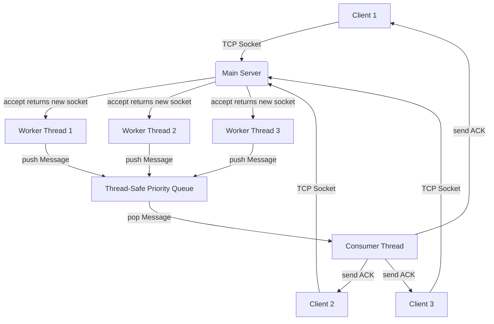
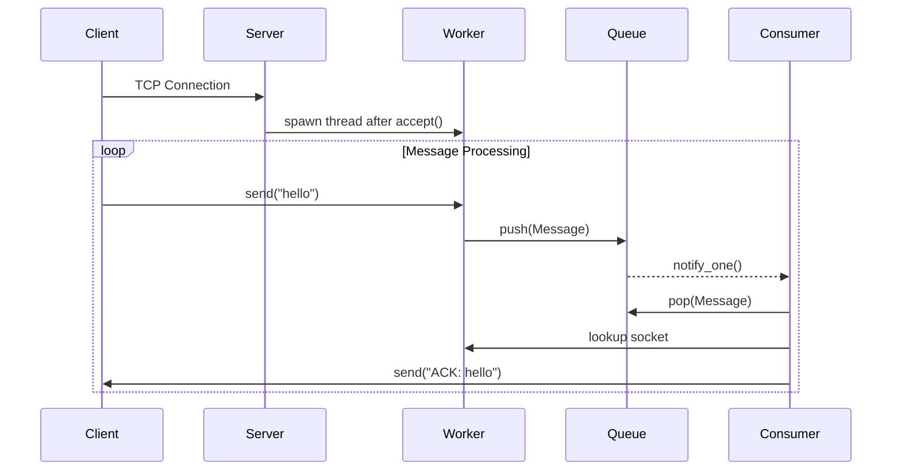
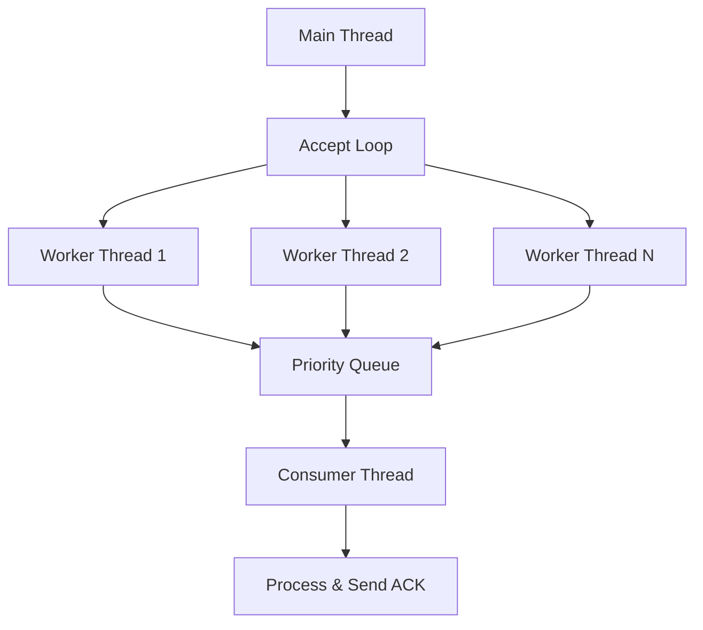

# 🚀 Multi-Threaded TCP Server in C++

> **A production-grade TCP server implementation demonstrating concurrent programming, thread-safe message processing, and priority-based task scheduling.**

[](https://isocpp.org/)
[]()
[]()

---

## 📋 Table of Contents

- [Overview](#-overview)
- [Why Build This?](#-why-build-this)
- [Architecture](#-architecture)
- [Core Concepts](#-core-concepts)
- [Implementation Details](#-implementation-details)
- [Getting Started](#-getting-started)
- [Testing](#-testing)
- [What's Next](#-whats-next)
- [Interview Prep](#-interview-prep)

---

## 🎯 Overview

This project implements a **concurrent TCP server** from scratch, featuring:

- ✅ **Multi-threaded connection handling** — one worker thread per client
- ✅ **Thread-safe priority queue** — decoupled message processing
- ✅ **Priority-based scheduling** — urgent messages processed first
- ✅ **Blocking I/O with efficient concurrency** — optimal resource usage
- ✅ **Production patterns** — mutex locks, condition variables, smart pointers

### What Makes This Special?

Most developers use frameworks without understanding the underlying mechanics. This project teaches you **how networking actually works** at the OS level.

---

## 💡 Why Build This?

### Real-World Applications

| Real System | Similar Concept |
|-------------|----------------|
| **Kafka** | Producer → Queue → Consumer pattern |
| **Redis** | Message broker architecture |
| **Nginx** | Non-blocking worker model |
| **WhatsApp** | Socket-per-client messaging |
| **Load Balancers** | Connection dispatch & routing |

### Skills You'll Master

- 🔧 OS-level socket programming
- 🧵 Multithreading & concurrency control
- 🔒 Race conditions, deadlocks, atomicity
- 📦 Message queues & priority scheduling
- ⚡ Blocking vs non-blocking I/O
- 🏗️ Scalable backend architecture

---

## 🏗️ Architecture

### High-Level System Design



### Message Flow Sequence



### Threading Model



---

## 🧠 Core Concepts

### 1. Network Programming Fundamentals

Think of networking like a phone system:

| Networking | Real-Life Analogy |
|-----------|-------------------|
| **Server** | Call center |
| **Client** | Customer calling |
| **Socket** | Telephone |
| **Port** | Extension number |
| **IP Address** | Phone number |
| `bind()` | Assign phone to desk |
| `listen()` | Wait for calls |
| `accept()` | Pick up the phone |
| `recv()/send()` | Conversation |
| `close()` | Hang up |

### 2. Server Boot Sequence

```
1. socket()   → Create communication endpoint
2. bind()     → Attach to IP:PORT
3. listen()   → Mark socket as passive (ready to accept)
4. accept()   → Block until client connects → return new socket
5. spawn worker thread → Handle client independently
6. recv() → process → send()
7. close() → Clean up connection
```

**Key Insight:** `accept()` returns a **new socket** for each client, enabling isolated communication.

### 3. Blocking I/O vs Non-Blocking

| Blocking I/O | Non-Blocking I/O |
|--------------|------------------|
| Thread sleeps until data arrives | Returns immediately (even if no data) |
| Efficient CPU usage | Can cause busy-waiting |
| Simpler to implement | Requires event loops (epoll/kqueue) |
| **Used in this project** | Used in high-performance servers |

**Why we use blocking:** Simplicity + efficient resource usage via OS-level thread scheduling.

### 4. Why Multithreading?

**Without threads:**
```
Client A connects → recv() blocks
Client B waits... stuck... slow... 😢
```

**With threads:**
```
Client A → Worker Thread A
Client B → Worker Thread B
Consumer Thread → Independent processing
✅ Concurrent, non-blocking, scalable
```

### 5. Why Use a Queue?

| Without Queue | With Queue |
|---------------|-----------|
| Worker does I/O + processing | Worker only handles I/O |
| Processing delays block recv() | Smooth continuous flow |
| No fairness guarantees | Priority scheduling possible |
| Hard to scale | Easy to scale (add more consumers) |

**Queue decouples I/O speed from processing speed.**

---

## ⚙️ Implementation Details

### Thread-Safe Priority Queue

**Priority Rules:**
1. Higher `priority` value → processed first
2. If equal priority → older timestamp first (FIFO)

**Synchronization:**
- **Mutex** — prevents concurrent access corruption
- **Condition Variable** — efficient sleeping (no busy-wait)
- **unique_ptr** — automatic memory management

```cpp
// Simplified concept
void push(Message msg) {
    std::lock_guard<std::mutex> lock(mtx);
    queue.push(std::move(msg));  // Transfer ownership
    cv.notify_one();  // Wake consumer
}

Message pop() {
    std::unique_lock<std::mutex> lock(mtx);
    cv.wait(lock, []{return !queue.empty();});  // Sleep until data
    auto msg = std::move(queue.top());
    queue.pop();
    return msg;
}
```

### Why Mutex & Locking?

**Without mutex:**
```
Thread A: Pushing message
Thread B: Popping simultaneously
→ Race condition → Memory corruption → 💥 Crash
```

**With mutex:**
```
Only ONE thread accesses shared resource at a time
→ Safe, predictable, correct
```

### Lock Types

| Lock Type | Use Case |
|-----------|----------|
| `lock_guard` | Short critical sections |
| `unique_lock` | Works with `wait()` and `notify()` |

**Best Practice:** Keep locks **short**. Never call `send()` or `recv()` inside locked sections (they block).

### Smart Pointers

**Why `unique_ptr`?**
- Raw pointers → manual delete → memory leak risk
- `unique_ptr` → automatic cleanup → zero overhead

```cpp
auto msg = std::make_unique<Message>(...);
queue.push(std::move(msg));  // Ownership transferred
// Automatically deleted when popped ✅
```

---

## 🚀 Getting Started

### Prerequisites

```bash
# C++17 compiler
g++ --version  # or clang++

# For testing
nc -h  # netcat (usually pre-installed)
```

### Build

```bash
g++ -std=c++17 -pthread server.cpp -o server
```

### Run Server

```bash
./server
# Server listening on 0.0.0.0:9090...
```

---

## 🧪 Testing

### Basic Connection Test

```bash
# Terminal 1: Run server
./server

# Terminal 2: Connect with netcat
nc localhost 9090
```

### Send Messages

```
hello
→ [ACK] Received: hello (Priority: 5)

urgent message
→ [ACK] Received: urgent message (Priority: 5)
```

### Multiple Clients

```bash
# Terminal 3
nc localhost 9090

# Terminal 4
nc localhost 9090

# All messages processed independently! ✅
```

### Test Priority (Future Feature)

```
/urgent critical alert
→ Processed before regular messages
```

---

## 📦 Component Breakdown

| Component | Type | Description | Lifecycle |
|-----------|------|-------------|-----------|
| **Main Thread** | Server entry | Runs accept loop | Server start |
| **Worker Thread** | Per-client | Handles recv() & push to queue | Client connects |
| **Consumer Thread** | Singleton | Pops queue & processes | Server start |
| **Priority Queue** | Shared state | Stores ordered tasks | Decouples work |
| **Socket Map** | Shared state | Maps clientId → socketFD | Thread-safe lookup |

---

## 🎯 What's Next?

### Extension Ideas

| Feature | Why Important |
|---------|---------------|
| **A. Priority Commands** | `/urgent` → schedule first |
| **B. Thread Pool** | Reuse threads (production-grade) |
| **C. Graceful Shutdown** | No dropped messages |
| **D. epoll/kqueue** | High-performance async I/O |
| **E. Logging System** | Production observability |
| **F. Broadcast Chat** | Multiplexing demo |
| **G. SSL/TLS** | Encrypted connections |


---

## 🎓 Interview Prep

### Topics You Now Understand

✅ **Networking:** Socket lifecycle, TCP/IP fundamentals  
✅ **Concurrency:** Threading models, race conditions, deadlocks  
✅ **Synchronization:** Mutexes, condition variables, atomics  
✅ **Data Structures:** Priority queues, thread-safe containers  
✅ **System Design:** Message brokers, producer-consumer patterns  
✅ **Memory Management:** Smart pointers, RAII, ownership semantics

### Common Interview Questions You Can Answer

1. **"Explain how a web server handles multiple clients"**  
   → Socket per client, thread per connection, queue for processing

2. **"What's the difference between blocking and non-blocking I/O?"**  
   → Blocking: thread sleeps (efficient). Non-blocking: returns immediately (requires event loop)

3. **"How do you prevent race conditions?"**  
   → Mutexes, atomic operations, immutable data, message passing

4. **"Design a chat server"**  
   → This project + broadcast logic + client registry

5. **"How would you scale this system?"**  
   → Thread pools, connection multiplexing (epoll), load balancers, microservices

---

## 📚 Resources

- [Beej's Guide to Network Programming](https://beej.us/guide/bgnet/)
- [POSIX Threads Programming](https://computing.llnl.gov/tutorials/pthreads/)
- [C++ Concurrency in Action](https://www.manning.com/books/c-plus-plus-concurrency-in-action-second-edition)

---

## 🤝 Acknowledgments

This project was built as a hands-on learning exercise with conceptual guidance from AI tools. All architecture decisions and code implementations were crafted manually to demonstrate real-world production patterns.

---

## 📄 License

MIT License - feel free to use this for learning, interviews, or production projects.

---

**Built with 💻 and ☕ to understand how the internet really works.**